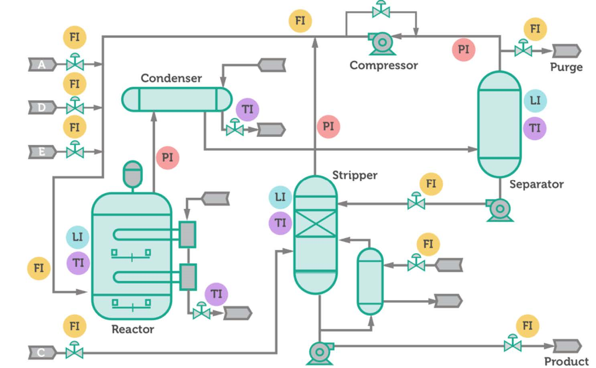

# Anomaly detection of the Tennessee Eastman Process

The Tennessee Eastman Process (TEP) emerges as a standard benchmark for anomaly detection in the fields of process control and process engineering. The TEP is essentially a real industrial process that was modeled computationally in 1993 by Downs and Vogel. The data recovered from this study is consistently utilised for comparing and benchmarking algorithms, especially anomaly detection algorithms. 

The TEP is comprised of 8 chemical components in total: 4 reactants, 2 products, 1 by-product and 1 inert component. These components undergo a chemical process dominated by 5 main process units: a reactor that allows for the reaction of the gaseous feed components (A, C, D and E) into liquid products (G and H), a condenser to cool-down the gaseous product stream coming out of the reactor, a gas-liquid separator to split gas and liquid components from the cooled product stream, a centrifugal compressor to flow this gas stream back into the reactor and a stripper to handle the efficient separation of the 2 products from any unreacted feed components. There is also a purge to remove the inert (B) and the by-product (F) from the system . A schematic of the underlying industrial process is given below.

Here, we will attempt to construct a machine-learning anomaly detection algorithm for the TEP, based on a dataset referenced in Rieth et al. (2017).

## Dataset

There are over 50 different variables that record properties of the system such as the flowrates, pressures, temperatures, levels, mole fractions and compressor power outputs. Over 10 of these are manipulated variables (flowrates, valve positions and the reaction agitator speed) which the operator can control to ensure that the chemical process is operating under control. Perhaps the most cited source of TEP data is the dataset set referenced in Rieth et al. (2017). Therein, process variables are sampled every 3 minutes for 25 hours in the training dataset, and 48 hours for the testing dataset. The main reason of this dataset's popularity is that it contains both a ‘fault-free’ and ‘faulty’ datafile. The former corresponds to the values of the TEP process when under normal operation while the latter contains 20 different simulated process faults. The dataset can be downloaded [here](https://dataverse.harvard.edu/dataset.xhtml?persistentId=doi:10.7910/DVN/6C3JR1).

## Model

The classifier that we use in this project is the XgBoost Classifier. XGBoost, which stands for Extreme Gradient Boosting, is a scalable, distributed gradient-boosted decision tree (GBDT) machine learning library. It provides parallel tree boosting and is the leading machine learning library for regression, classification, and ranking problems. Its exceptional performance is the main reason for choosing this model. The implementation is motivated by this [github repository](https://github.com/mrunal46/TEP-Fault-Detection).

## Hyperparameter optimisation

To tune the XgBoost classifier, we choose n_estimators and max depth as hyperparamters. Specifically, n_estimators is the number of gradient boosted trees, i.e., the number of boosting rounds, and max_depth denotes the maximum tree depth for base learners. For simplicity, hyperparameter optimisation is carried out via gridsearch.

## Results 

We use the F1 micro score as performance metric. F1 score is suitable for evaluating in parallel high precision and model's high recall. In fact, we need to trade off precision for recall, and hence, F1 score is the a good choice. Since we have a multiclass classification problem, where we need to predict among 21 different working conditions, micro F1 score is a suitable metric.

Xgboot results in an FDR of 0.68 which is quite acceptable given the reduction of the dataset. We expect far better results if a larger sample can be admitted. Here, due to limited computing resources, only a relatively small dataset can be processed.

The confusion, precision, and recall matrices can be seen in the jupyter notebook provided.

## References

Source of dataset used:

Rieth, Cory A.; Amsel, Ben D.; Tran, Randy; Cook, Maia B., 2017, "Additional Tennessee Eastman Process Simulation Data for Anomaly Detection Evaluation", https://doi.org/10.7910/DVN/6C3JR1, Harvard Dataverse, V1

The python implementation is motivated by this [github repository](https://github.com/mrunal46/TEP-Fault-Detection).

The analysis is motivated by this [post](https://keepfloyding.github.io/posts/Ten-East-Proc-Intro/).

## Contact details

email: lefterisvl83@gmail.com
